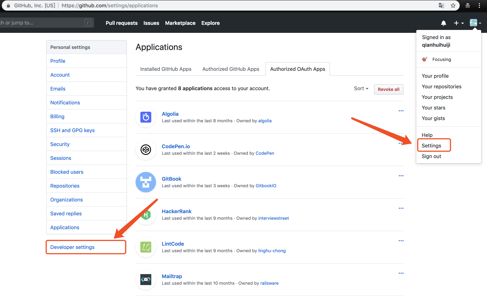
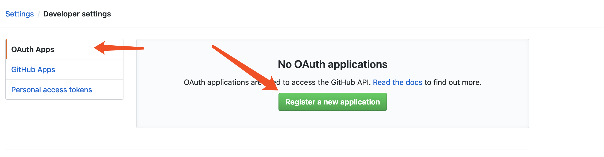
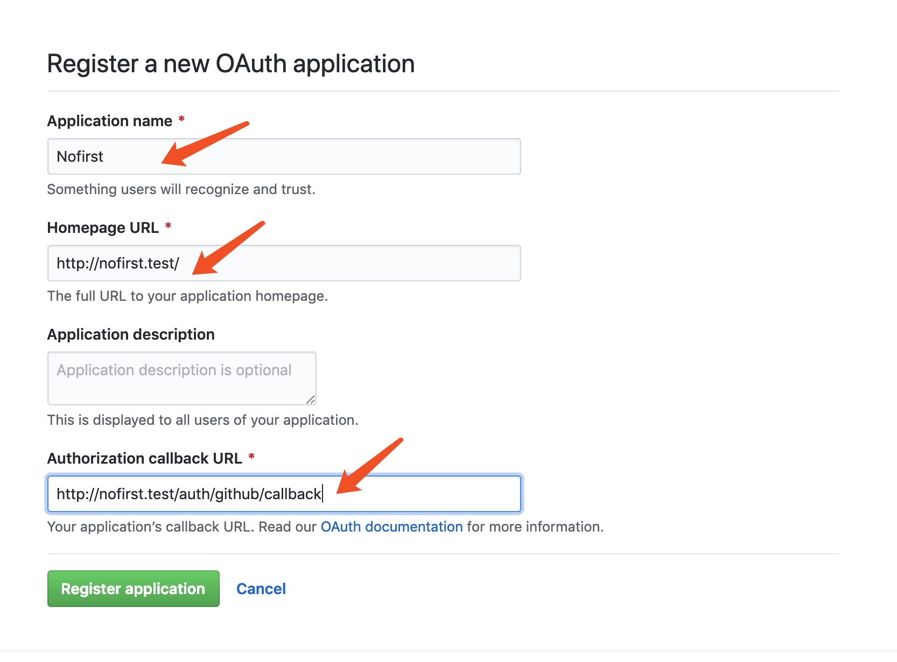
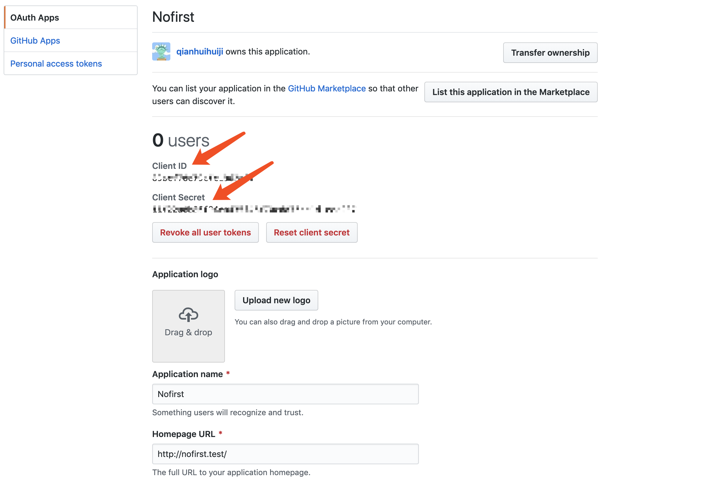
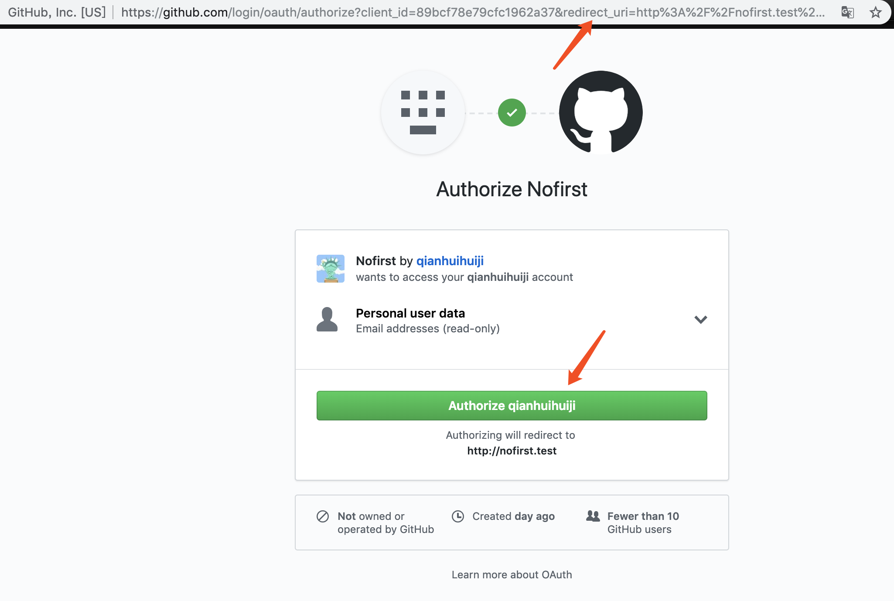
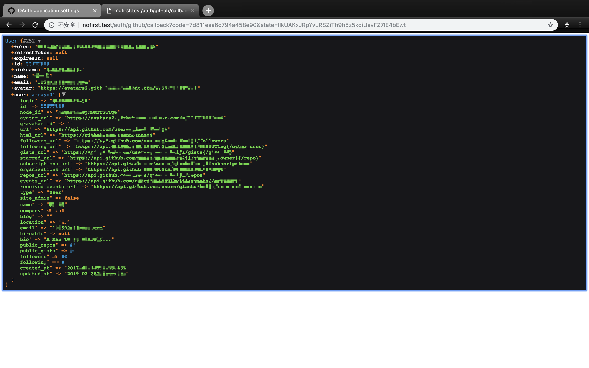

### 本节说明
* 对应第 2 小节：Authentication With GitHub

### 本节内容
本节我们来学习第三方登录，我们将以 GitHub 登录作为示例。首先我们需要安装 `laravel/socialite` 包到项目中：
```
composer require laravel/socialite
```
在使用 Socialite 之前，我们还需要为应用程序使用的 OAuth 服务添加凭据。 这些凭证应该放在你的 `config/services.php` 配置文件中，并且应该使用密钥 
。以 GitHub 为例：
```
'github' => [
    'client_id' => env('GITHUB_CLIENT_ID'),
    'client_secret' => env('GITHUB_CLIENT_SECRET'),
    'redirect' => env('GITHUB_CALLBACK_URL'),
],
```
从以上代码可知，我们需要在 `.env` 文件中维护配置值：

*.env*

```
GITHUB_CLIENT_ID=
GITHUB_CLIENT_SECRET=
GITHUB_CALLBACK_URL=
```

我们要从 GitHub 上获取相关配置，按如下步骤所示操作：



点击注册按钮：



填写以下内容：



然后我们就可以得到相关配置的值了：



然后我们来配置路由：

```
Route::get('auth/github', 'Auth\LoginController@redirectToProvider');
Route::get('auth/github/callback', 'Auth\LoginController@handleProviderCallback');
```

添加控制器方法：

*app/Http/Controllers/Auth/LoginController.php*

```
.
.
/**
* Redirect the user to the GitHub authentication page.
*
* @return \Illuminate\Http\Response
*/
public function redirectToProvider()
{
    return Socialite::driver('github')->redirect();
}

/**
* Obtain the user information from GitHub.
*
* @return \Illuminate\Http\Response
*/
public function handleProviderCallback()
{
    $user = Socialite::driver('github')->user();

    dd($user);
    // $user->token;
}
.
.
```
现在当我们访问 `login/github` 路由时，就会重定向到 GitHub 网站，进行授权验证。如下图所示：



注意 uri 中带的参数 `redirect_uri`，当授权通过时，将通过该地址重定向回我们的应用。现在我们点击授权按钮：



已经成功获取到用户的信息！