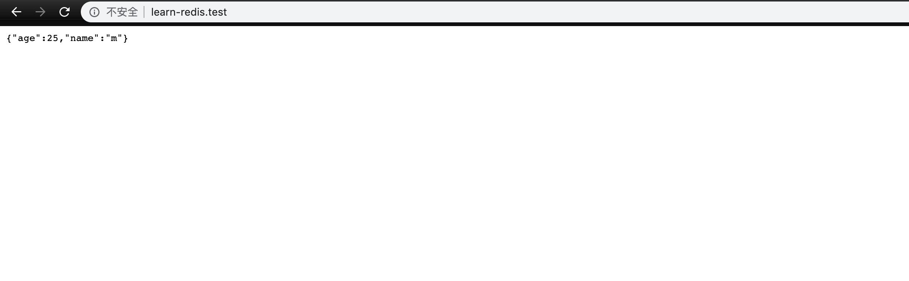

### 本节说明

* 对应第 4 小节：Hashes and Caching

### 本节内容

这一节我们来学习 `hash`。`hash` 是一个 `string` 类型的 `field` 和 `value` 的映射表，`hash` 特别适合用于存储对象。

下表列出了 `hash` 的基本命令：

| 序号 | 命令及描述 |
| ------ | ------ |
| 1 |	HDEL key field1 [field2] 删除一个或多个哈希表字段
| 2 |	HEXISTS key field 查看哈希表 key 中，指定的字段是否存在。
| 3 |	HGET key field 获取存储在哈希表中指定字段的值。
| 4 |	HGETALL key 获取在哈希表中指定 key 的所有字段和值
| 5 |	HINCRBY key field increment 为哈希表 key 中的指定字段的整数值加上增量 increment 。
| 6 |	HINCRBYFLOAT key field increment 为哈希表 key 中的指定字段的浮点数值加上增量 increment 。
| 7 |	HKEYS key 获取所有哈希表中的字段
| 8 |	HLEN key 获取哈希表中字段的数量
| 9 |	HMGET key field1 [field2] 获取所有给定字段的值
| 10 |	HMSET key field1 value1 [field2 value2 ] 同时将多个 field-value (域-值)对设置到哈希表 key 中。
| 11 |	HSET key field value 将哈希表 key 中的字段 field 的值设为 value 。
| 12 |	HSETNX key field value 只有在字段 field 不存在时，设置哈希表字段的值。
| 13 |	HVALS key 获取哈希表中所有值
| 14 |	HSCAN key cursor [MATCH pattern] [COUNT count] 迭代哈希表中的键值对

在命令行测试：

```
redis-cli
```

```
127.0.0.1:6379> HMSET users.1.status favorites 10 watchLater 20
OK
127.0.0.1:6379> HSET users.1.status inProgress 50
(integer) 1
127.0.0.1:6379> HGET users.1.status inProgress
"50"
127.0.0.1:6379> HGETALL users.1.status
1) "favorites"
2) "10"
3) "watchLater"
4) "20"
5) "inProgress"
6) "50"
```

接下来我们应用在代码中：

*routes/web.php*

```
<?php

Route::get('/',function () {
    $user1Stats = [
        'favorites' => 10,
        'watchLater' => 20,
        'inProgress' => 40,
    ];

    // Redis::hmset('user.1.stats',$user1Stats);

    return Redis::hgetall('user.1.stats');
});

Route::get('/favorite',function () {

    Redis::hincrby('user.1.stats','favorites',1);

    return redirect('/');
});
```

在实际情况中，我们会在项目发布的时候初始化数据：

```
Redis::hmset('user.1.stats',$user1Stats);
```

另外我们还需要知道的是，`Redis` 是 `Laravel` 支持的缓存驱动之一，我们来花点时间了解下。首先我们修改缓存驱动为 `Redis`：

*.env*

```
.
CACHE_DRIVER=redis
.
```

*routes/web.php*

```
<?php
use Illuminate\Support\Facades\Cache;

Route::get('/',function () {
    // $user1Stats = [
    //     'favorites' => 10,
    //     'watchLater' => 20,
    //     'inProgress' => 40,
    // ];

    // Redis::hmset('user.1.stats',$user1Stats);

    // return Redis::hgetall('user.1.stats');

    Cache::put('foo',['age' => 25,'name' => 'm']);

    return Cache::get('foo');
});
```

访问页面会看到如下输出：



但是，如果我们直接从 `redis-cli` 获取 `foo` 的值，会发现为空：

```
127.0.0.1:6379> GET foo
(nil)
```

这里面有两个原因，首先是 `Laravel` 在储存缓存时会给我们加上前缀：

*config/cache.php*

```
    .
    .
  'prefix' => env('CACHE_PREFIX', Str::slug(env('APP_NAME', 'laravel'), '_').'_cache'),
];
```

并且，在缓存中使用 `redis` 驱动时，保存的内容会放在 `redis` 下标为 `1` 数据库中：

*config/database.php*

```
    .
    .
    'redis' => [
        .
        .
        'cache' => [
            'host' => env('REDIS_HOST', '127.0.0.1'),
            'password' => env('REDIS_PASSWORD', null),
            'port' => env('REDIS_PORT', 6379),
            'database' => env('REDIS_CACHE_DB', 1),
        ],

    ],

];
```

所以我们需要切换数据库：

```
127.0.0.1:6379> SELECT 1
OK
127.0.0.1:6379[1]> KEYS *
1) "laravel_cache:foo"
127.0.0.1:6379[1]> GET laravel_cache:foo
"a:2:{s:3:\"age\";i:25;s:4:\"name\";s:1:\"m\";}"
```

同时需要注意一点，存储在 `redis` 中的缓存会被 `Laravel` 序列化，当我们取出缓存时， `Laravel` 会自动反序列化，也就是浏览器显示的那样。