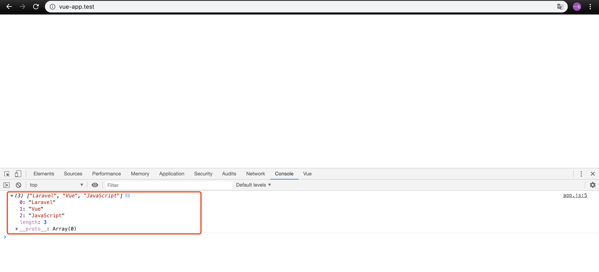
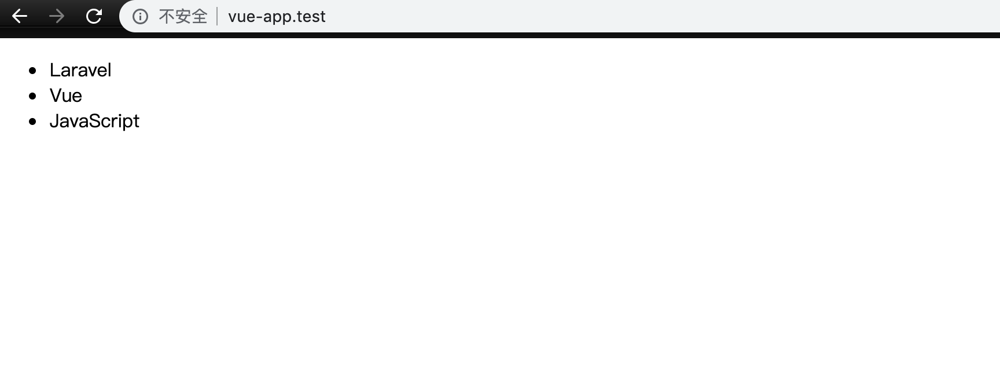

### 本节说明
* 对应第 18 小节：Vue Ajax Requests With Axios

### 本节内容

我们继续前进，本节我们来探究 `Vue` 发送 `ajax` 请求到后端，与后端通信。我们的起点是一个新的 `Laravel` 项目：
```
laravel new vue-app
```
 我们知道，`Laravel` 为  `Vue` 默认提供了开发环境，我们只需在  `resources/js/components` 文件夹下开发我们的组件即可。但是在本节中，我们不进入这个流程，我们在 `public` 文件夹下直接开发我们的组件，而不经过前端工作流进行编译。

 `Laravel` 为我们提供了默认的首页，即 `resources/views/welcome.blade.php`。我们将在此页面以  `CDN` 的方式引入 `Vue`，以及  `axios` 依赖：

```
<!doctype html>
<html lang="{{ str_replace('_', '-', app()->getLocale()) }}">
    <head>
        <meta charset="utf-8">
        <meta name="viewport" content="width=device-width, initial-scale=1">

        <title>Laravel</title>
    </head>
    <body>
        <div id="root">

        </div>


        <script src="https://unpkg.com/vue@2.1.3/dist/vue.js"></script>
        <script src="https://unpkg.com/axios/dist/axios.min.js"></script>
        <script src="/js/app.js"></script>
        
    </body>

</html>

```
接着我们来实例化 `Vue` 组件，修改成如下：

*public/js/app.js*
```
new Vue({
    el:'#root',

    mounted() {
        axios.get('/skills').then(response => console.log(response.data));
    }
}); 
```

我们向 `http://vue-app.test/skills` 发送了 `get` 请求，但是此时路由不存在，我们来注册它：

*routes/web.php*
```
<?php

Route::get('/', function () {
    return view('welcome');
});

Route::get('/skills', function () {
    return ['Laravel','Vue','JavaScript'];
});

```

现在我们来访问页面：



我们已经成功获取到了数据！接下来我们来将数据显示出来：

*public/js/app.js*
```
new Vue({
    el:'#root',

    data: {
        skills: []
    },

    mounted() {
        axios.get('/skills').then(response => this.skills = response.data);
    }
}); 
```

*resources/views/welcome.blade.php*
```
.
.
<body>
    <div id="root">
        <ul>
            <li v-for="skill in skills" v-text="skill"></li>
        </ul>
    </div>


    <script src="https://unpkg.com/vue@2.1.3/dist/vue.js"></script>
    <script src="https://unpkg.com/axios/dist/axios.min.js"></script>
    <script src="/js/app.js"></script>
    
</body>
```

刷新页面：

