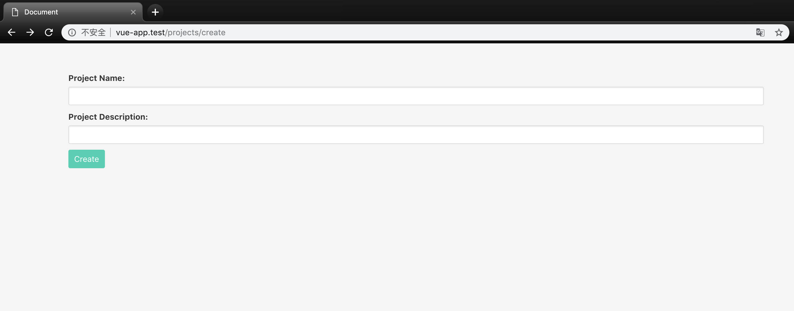

### 本节说明

* 对应第 19 小节：Object Oriented Forms Part-1

### 本节内容

 本节我们开始学习如何使用 `Vue` 来进行表单提交。下面是准备工作：
 
 *routes/web.php*
```
Route::get('projects/create','ProjectsController@create');
Route::post('projects','ProjectsController@store');
```

*app/Project.php*

```
<?php

namespace App;

use Illuminate\Database\Eloquent\Model;

class Project extends Model
{
    
}
```

*app/Http/Controllers/ProjectsController.php*

```
<?php

namespace App\Http\Controllers;

use App\Project;
use Illuminate\Http\Request;

class ProjectsController extends Controller
{
    /**
     * Show the form for creating a new resource.
     *
     * @return \Illuminate\Http\Response
     */
    public function create()
    {
        return view('projects.create',[
            'projects' => Project::all()
        ]);
    }

    /**
     * Store a newly created resource in storage.
     *
     * @param  \Illuminate\Http\Request  $request
     * @return \Illuminate\Http\Response
     */
    public function store(Request $request)
    {
        $this->validate(request(),[
            'name' => 'required',
            'description' => 'required'
        ]);

        Project::forecCreate([
            'name' => request('name'),
            'description' => request('description')
        ]); 

        return ['message' => 'Project created!'];
    }
}
```

*resources/views/projects/create.blade.php*

```
<!DOCTYPE html>
<html lang="en">
<head>
    <meta charset="urf-8">
    <title>Document</title>
    <link rel="stylesheet" href="https://cdnjs.cloudflare.com/ajax/libs/bulma/0.2.3/css/bulma.css">
    <style> body{padding-top: 40px} </style>
</head>

<body>
    <div id="app" class="container">
        @include('projects.list')

        <form method="POST" action="/projects">
            <div class="control">
                <label for="name" class="label">Project Name:</label>
                
                <input type="text" id="name" name="name" class="input">
            </div>

            <div class="control">
                <label for="description" class="label">Project Description:</label>
                
                <input type="text" id="description" name="description" class="input">
            </div>

            <div class="control">
                <button class="button is-primary">Create</button>
            </div>
        </form>
    </div>

    <script src="https://unpkg.com/vue@2.1.3/dist/vue.js"></script>
    <script src="https://unpkg.com/axios/dist/axios.min.js"></script>
    <script src="/js/app.js"></script>
</body>

</html>
```

*resources/views/projects/list.blade.php*

```
<div class="control">
    <ul>
        @foreach ($projects as $project)
            <li>{{ $project->name }}</li>
        @endforeach
    </ul>
</div>
```

*database/migrations/{timestamp}_create_projects_table.php*

```
<?php

use Illuminate\Support\Facades\Schema;
use Illuminate\Database\Schema\Blueprint;
use Illuminate\Database\Migrations\Migration;

class CreateProjectsTable extends Migration
{
    /**
     * Run the migrations.
     *
     * @return void
     */
    public function up()
    {
        Schema::create('projects', function (Blueprint $table) {
            $table->bigIncrements('id');
            $table->string('name');
            $table->text('description');
            $table->timestamps();
        });
    }

    /**
     * Reverse the migrations.
     *
     * @return void
     */
    public function down()
    {
        Schema::dropIfExists('projects');
    }
}
```

准备工作完成后，我们在浏览器查看页面：



接下来我们正式开始我们的内容：