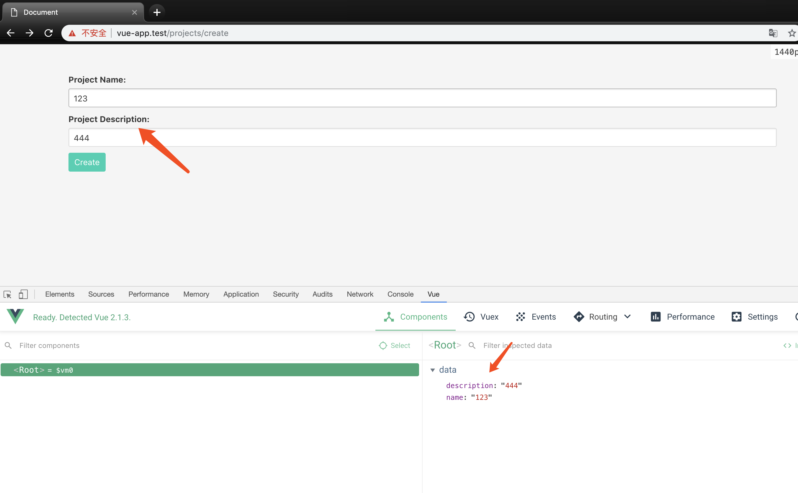
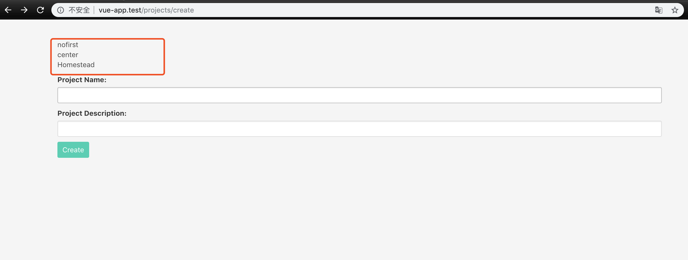
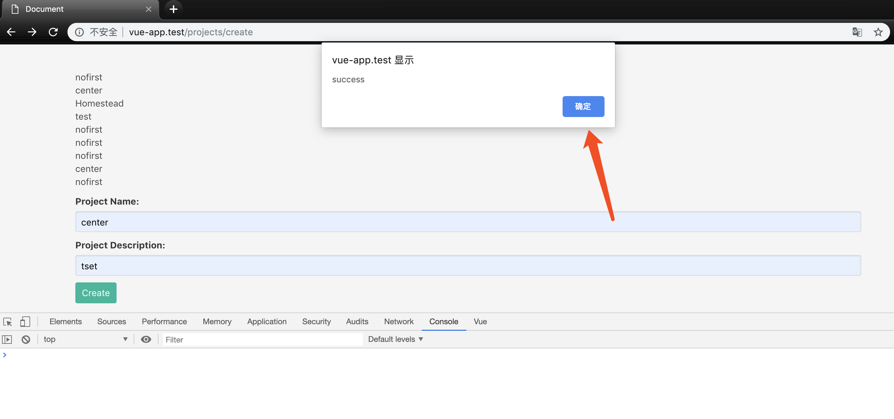
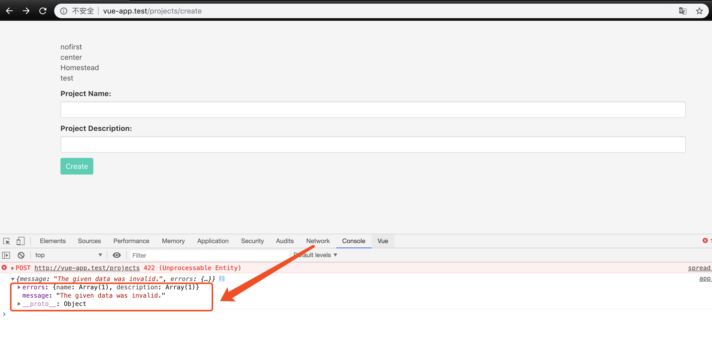
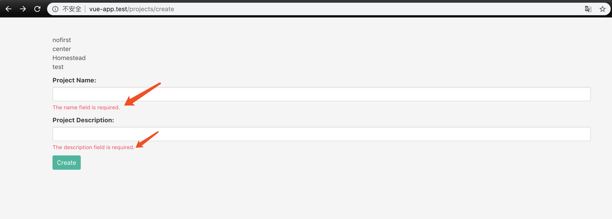
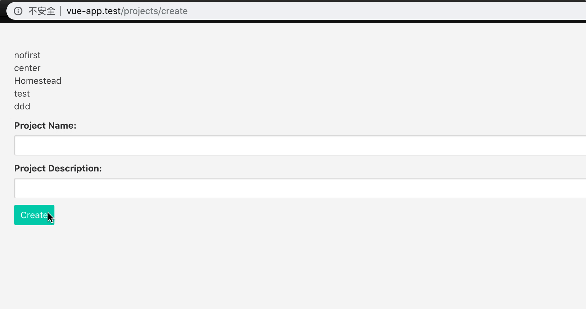

### 本节说明

* 对应第 19 小节：Object Oriented Forms Part-1

### 本节内容

 本节我们开始学习如何使用 `Vue` 来进行表单提交。下面是准备工作：
 
 *routes/web.php*
```
Route::get('projects/create','ProjectsController@create');
Route::post('projects','ProjectsController@store');
```

*app/Project.php*

```
<?php

namespace App;

use Illuminate\Database\Eloquent\Model;

class Project extends Model
{
    
}
```

*app/Http/Controllers/ProjectsController.php*

```
<?php

namespace App\Http\Controllers;

use App\Project;
use Illuminate\Http\Request;

class ProjectsController extends Controller
{
    /**
     * Show the form for creating a new resource.
     *
     * @return \Illuminate\Http\Response
     */
    public function create()
    {
        return view('projects.create',[
            'projects' => Project::all()
        ]);
    }

    /**
     * Store a newly created resource in storage.
     *
     * @param  \Illuminate\Http\Request  $request
     * @return \Illuminate\Http\Response
     */
    public function store(Request $request)
    {
        $this->validate(request(),[
            'name' => 'required',
            'description' => 'required'
        ]);

        Project::forecCreate([
            'name' => request('name'),
            'description' => request('description')
        ]); 

        return ['message' => 'Project created!'];
    }
}
```

*resources/views/projects/create.blade.php*

```
<!DOCTYPE html>
<html lang="en">
<head>
    <meta charset="urf-8">
    <title>Document</title>
    <link rel="stylesheet" href="https://cdnjs.cloudflare.com/ajax/libs/bulma/0.2.3/css/bulma.css">
    <style> body{padding-top: 40px} </style>
</head>

<body>
    <div id="app" class="container">
        @include('projects.list')

        <form method="POST" action="/projects">
            <div class="control">
                <label for="name" class="label">Project Name:</label>
                
                <input type="text" id="name" name="name" class="input">
            </div>

            <div class="control">
                <label for="description" class="label">Project Description:</label>
                
                <input type="text" id="description" name="description" class="input">
            </div>

            <div class="control">
                <button class="button is-primary">Create</button>
            </div>
        </form>
    </div>

    <script src="https://unpkg.com/vue@2.1.3/dist/vue.js"></script>
    <script src="https://unpkg.com/axios/dist/axios.min.js"></script>
    <script src="/js/app.js"></script>
</body>

</html>
```

*resources/views/projects/list.blade.php*

```
<div class="control">
    <ul>
        @foreach ($projects as $project)
            <li>{{ $project->name }}</li>
        @endforeach
    </ul>
</div>
```

*database/migrations/{timestamp}_create_projects_table.php*

```
<?php

use Illuminate\Support\Facades\Schema;
use Illuminate\Database\Schema\Blueprint;
use Illuminate\Database\Migrations\Migration;

class CreateProjectsTable extends Migration
{
    /**
     * Run the migrations.
     *
     * @return void
     */
    public function up()
    {
        Schema::create('projects', function e(Blueprint $table) {
            $table->bigIncrements('id');
            $table->string('name');
            $table->text('description');
            $table->timestamps();
        });
    }

    /**
     * Reverse the migrations.
     *
     * @return void
     */
    public function down()
    {
        Schema::dropIfExists('projects');
    }
}
```

准备工作完成后，我们在浏览器查看页面：


接下来我们正式开始我们的内容。第一步我们来绑定 `name` 和 `description`：

*resources/views/projects/create.blade.php*

```
    .
    .
    <form method="POST" action="/projects">
        <div class="control">
            <label for="name" class="label">Project Name:</label>
            
            <input type="text" id="name" name="name" class="input" v-model="name">
        </div>

        <div class="control">
            <label for="description" class="label">Project Description:</label>
            
            <input type="text" id="description" name="description" class="input" v-model="description">
        </div>
        .
        .

```

*public/js/app.js*

```
new Vue({
    el:'#app',

    data: {
        name: '',
        description: ''
    }
}); 
```

效果如图：



现在我们来完善我们的逻辑：点击 `Create` 按钮，异步提交表单。首先我们要修改表单：

```
<form method="POST" action="/projects" @submit.prevent="onSubmit">
```

注意 `@submit.prevent`，我们使用了 `Vue` 提供的 [事件修饰符](https://cn.vuejs.org/v2/guide/events.html),从而达到点击按钮触发 `onSubmit` 方法，并且提交事件不再重载页面的目的。接下来就是新增 `onSubmit` 方法：

*public/js/app.js*

```
new Vue({
    el:'#app',

    data: {
        name: '',
        description: ''
    },

    methods: {
        onSubmit() {
            axios.post('/projects',this.$data);
        }
    }
})
```

>注：使用 `this.$dat` 将 `data` 对象的全部提交。

现在我们可以在页面进行创建的测试，成功后的结果如图：



下面我们来为创建成功加上反馈：

*public/js/app.js*

```
onSubmit() {
    axios.post('/projects',this.$data)
        .then(response => alert('success'));
```

再次创建：



通常情况下，我们还会限定 `name` 和 `description` 字段必填。`Laravel` 为我们提供了表单验证功能，并且我们已经成功应用：

*app/Http/Controllers/ProjectsController.php*

```
.
.
public function store(Request $request)
{
    $this->validate(request(),[
        'name' => 'required',
        'description' => 'required'
    ]);
    .
}
.
```

所以我们可以把验证交给后端来处理，在前端提示验证不通过的提示即可。首先我们来捕获验证不通过的异常：

```
onSubmit() {
    axios.post('/projects',this.$data)
        .then(response => alert('success'))
        .catch(error => console.log(error.response.data));
}
```

尝试提交空白表单：



现在我们已经获取到了服务端返回的错误提示，在 `response.data.errors` 属性中显示了所有的错误。接下来我们要做的就是展示服务端返回的错误提示：

*public/js/app.js*

```
class Errors {
    constructor() {
        this.errors = {};
    }

    get(field) {
        if(this.errors[field]) {
            return this.errors[field][0];
        }
    }

    record(errors) {
        this.errors = errors;
    }
}

new Vue({
    el:'#app',

    data: {
        name: '',
        description: '',
        errors: new Errors()
    },

    methods: {
        onSubmit() {
            axios.post('/projects',this.$data)
                .then(response => alert('success'))
                .catch(error => this.errors.record(error.response.data.errors));
        }
    }
})
```

在上面的代码中，我们定义了一个 `Error` 类，该类在初始化时会有一个值为空对象的属性 `error`。我们实例化 `Vue` 时，实例化 `Error` 类，并绑定到 `Vue` 实例的 `errors` 属性。在我们捕获到服务端返回的验证的错误时，我们更新 `Error` 类的 `error` 属性，这样我们就能通过 `error.get('name')` 获取到返回的错误中关于 `name` 的错误提示：

*resources/views/projects/create.blade.php*

```
.
.
<div class="control">
    <label for="name" class="label">Project Name:</label>
    
    <input type="text" id="name" name="name" class="input" v-model="name">

    <span class="help is-danger" v-text="errors.get('name')"></span>
</div>

<div class="control">
    <label for="description" class="label">Project Description:</label>
    
    <input type="text" id="description" name="description" class="input" v-model="description">

    <span class="help is-danger" v-text="errors.get('description')"></span>
</div>
.
.
```

再次尝试提交空白表单：



当我们再次输入时，我们想让错误提示消失。常见的做法是增加一个 `clear()` 方法，清空属性：

*public/js/app.js*

```
class Errors {
    constructor() {
        this.errors = {};
    }

    get(field) {
        if(this.errors[field]) {
            return this.errors[field][0];
        }
    }

    record(errors) {
        this.errors = errors;
    }

    clear(field) {
        delete this.errors[field];
    }
}
.
.
```

在页面应用：

*resources/views/projects/create.blade.php*

```
<input type="text" id="name" name="name" class="input" v-model="name" @keydown="errors.clear('name')">
```

在页面尝试：



我们当然可以这么做，但是想像一下，当你的表单有几十个字段需要处理时，相信我，你一定会抓狂。所以我们进行下优化：

*resources/views/projects/create.blade.php*

```
<form method="POST" action="/projects" @submit.prevent="onSubmit" @keydown="errors.clear($event.target.name)">
```

这样一来，当表单中的任意一个元素触发 `keydown` 事件时，我们通过 `$event.target.name`获取到该元素的 `name` 属性，然后触发 `clear` 方法。

再次尝试：


最后，我们还有两个优化的地方。首先，没有错误时，我们不显示错误提示的 `span` 元素，因为会出现不自然的间距；然后，当任意一个错误提示存在时，不能点击 `Create` 按钮进行提交。

首先我们来看第一个问题，我们提供一个 `errors.has(field)` 方法来判断是否存在 `filed` 类型的错误即可：

*public/js/app.js*

```
class Errors {
    constructor() {
        this.errors = {};
    }

    get(field) {
        if(this.errors[field]) {
            return this.errors[field][0];
        }
    }

    has(field) {
        return this.errors.hasOwnProperty(field);
    }
    .
    .

```

*resources/views/projects/create.blade.php*

```
.
.
<span v-if="errors.has('name')" class="help is-danger" v-text="errors.get('name')"></span>
.
<span class="help is-danger" v-text="errors.get('description')"></span>
.
.
```

然后我们提供一个 `errors.any()` 方法，来判断是否存在错误，进而决定按钮是否可以点击：

*public/js/app.js*

```
class Errors {
    constructor() {
        this.errors = {};
    }

    get(field) {
        if(this.errors[field]) {
            return this.errors[field][0];
        }
    }

    has(field) {
        return this.errors.hasOwnProperty(field);
    }

    any() {
        return Object.keys(this.errors).length > 0;
    }
    .
    .

```

*resources/views/projects/create.blade.php*

```
<div class="control">
    <button class="button is-primary" :disabled="errors.any()">Create</button>
</div>
```

再次尝试：

