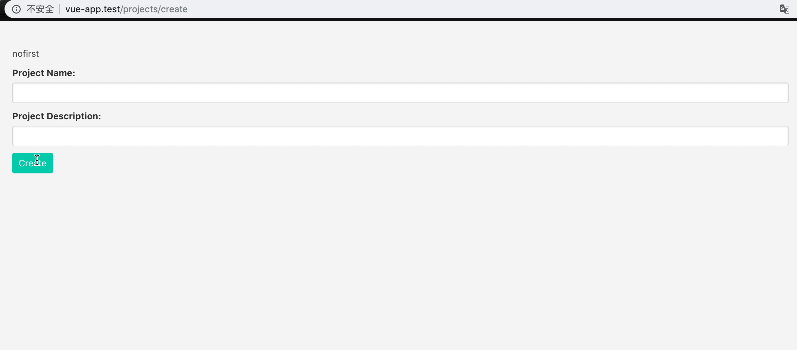

### 本节说明

* 对应第 20 小节：Object Oriented Forms Part-2

### 本节内容

我们接着上一节的内容。首先我们来修改下上一节成功创建的逻辑：

*public/js/app.js*

```
.
.
onSubmit() {
    axios.post('/projects',this.$data)
        .then(this.onSuccess)
        .catch(error => this.errors.record(error.response.data.errors));
},

onSuccess(response) {
    alert(response.data.message);
}
.
.
```

现在我们就可以在服务端决定我们成功创建后返回的消息。我们来新建一个 `Form` 类，将我们的表单视为该类的一个实例，并且 `errors` 也可以当成该实例的一个属性。

*public/js/app.js*

```
class Errors {
    constructor() {
        this.errors = {};
    }

    get(field) {
        if(this.errors[field]) {
            return this.errors[field][0];
        }
    }

    has(field) {
        return this.errors.hasOwnProperty(field);
    }

    any() {
        return Object.keys(this.errors).length > 0;
    }

    record(errors) {
        this.errors = errors;
    }

    clear(field) {
        delete this.errors[field];
    }
}

class Form {
    constructor(data) {
        this.originalData = data;

        for ( let field in data) {
            this[field] = data[field];
        }

        this.errors = new Errors()
    }

    reset() {
        
    }
}

new Vue({
    el:'#app',

    data: {
        form: new Form({
            name: '',
            description: '',
        })
    },

    methods: {
        onSubmit() {
            axios.post('/projects',this.$data)
                .then(this.onSuccess)
                .catch(error => this.form.errors.record(error.response.data.errors));
        },

        onSuccess(response) {
            alert(response.data.message);

            form.reset();
        }
    }
})
```

需要注意地是，上一节我们定义的属性需要更新，例如 `name` 要修改成 `form.name`，`errors` 要修改成 `form.errors`，修改后如下：

*resources/views/projects/create.blade.php*

```
<!DOCTYPE html>
<html lang="en">
<head>
    <meta charset="urf-8">
    <title>Document</title>
    <link rel="stylesheet" href="https://cdnjs.cloudflare.com/ajax/libs/bulma/0.2.3/css/bulma.css">
    <style> body{padding-top: 40px} </style>
</head>

<body>
    <div id="app" class="container">
        @include('projects.list')

        <form method="POST" action="/projects" @submit.prevent="onSubmit" @keydown="form.errors.clear($event.target.name)">
            <div class="control">
                <label for="name" class="label">Project Name:</label>
                
                <input type="text" id="name" name="name" class="input" v-model="form.name">

                <span v-if="form.errors.has('name')" class="help is-danger" v-text="form.errors.get('name')"></span>
            </div>

            <div class="control">
                <label for="description" class="label">Project Description:</label>
                
                <input type="text" id="description" name="description" class="input" v-model="form.description">

                <span class="help is-danger" v-text="form.errors.get('description')"></span>
            </div>

            <div class="control">
                <button class="button is-primary" :disabled="form.errors.any()">Create</button>
            </div>
        </form>
    </div>

    <script src="https://unpkg.com/vue@2.1.3/dist/vue.js"></script>
    <script src="https://unpkg.com/axios/dist/axios.min.js"></script>
    <script src="/js/app.js"></script>
</body>

</html>
```

有了 `Form` 类之后，我们就能将一些动作抽象到该类中，例如表单提交、成功后动作、得到错误后的动作等。当我们将这些方法进行封装之后，只要我们实例化 `Form` 类，我们就能调用这些方法。首先是跟提交相关的动作：

```
.
.
class Form {
    constructor(data) {
        this.originalData = data;

        for ( let field in data) {
            this[field] = data[field];
        }

        this.errors = new Errors()
    }

    data() {
        let data = Object.assign({},this);

        delete data.originalData;
        delete data.errors;

        return data;
    }

    submit(requestType,url) {
        axios[requestType](url,this.data())
                .then(this.onSuccess.bind(this))
                .catch(this.onFail.bind(this));
    }

    onSuccess(response) {
        alert(response.data.message);

        this.errors.clear();
        this.reset();
    }

    onFail(error) {
        this.errors.record(error.response.data.errors);
    }

    reset() {
        for (let field in this.originalData) {
            this[field] = '';
        }
    }
    .
}
.
.
```

首先我们定义了 `submit()` 方法，该函数需要两个参数：请求类型跟地址；然后我们通过 `data()` 方法来获取需要提交的实例的属性，即除了 `originalData` 和 `errors` 之外所有的属性；如果请求成功，那我们调用 `onSuccess()` 方法，否则调用 `onFail()`，并且在调用这两个方法的时候我们都使用了 `bind()` 方法改变了 `this` 的指向（让它指向了类本身）。所以我们在 `Vue` 实例中只需像下面那样调用即可：

```
.
.
new Vue({
    el:'#app',

    data: {
        form: new Form({
            name: '',
            description: '',
        })
    },

    methods: {
        onSubmit() {
            this.form.submit('post','/projects');
        }
    }
})
```

我们在调用 `onSuccess()` 方法时，同时调用了 `errors.clear()` 方法来清除所有错误提示，所以 `clear()` 方法要进行如下修改：

```
clear(field) {
    if(field) {
        delete this.errors[field];

        return;
    }

    this.errors = {};
}

```

最终代码如下：

```
class Errors {
    constructor() {
        this.errors = {};
    }

    get(field) {
        if(this.errors[field]) {
            return this.errors[field][0];
        }
    }

    has(field) {
        return this.errors.hasOwnProperty(field);
    }

    any() {
        return Object.keys(this.errors).length > 0;
    }

    record(errors) {
        this.errors = errors;
    }

    clear(field) {
        if(field) {
            delete this.errors[field];

            return;
        }

        this.errors = {};
    }
}

class Form {
    constructor(data) {
        this.originalData = data;

        for ( let field in data) {
            this[field] = data[field];
        }

        this.errors = new Errors()
    }

    data() {
        let data = Object.assign({},this);

        delete data.originalData;
        delete data.errors;

        return data;
    }

    submit(requestType,url) {
        axios[requestType](url,this.data())
                .then(this.onSuccess.bind(this))
                .catch(this.onFail.bind(this));
    }

    onSuccess(response) {
        alert(response.data.message);

        this.errors.clear();
        this.reset();
    }

    onFail(error) {
        this.errors.record(error.response.data.errors);
    }

    reset() {
        for (let field in this.originalData) {
            this[field] = '';
        }
    }
}

new Vue({
    el:'#app',

    data: {
        form: new Form({
            name: '',
            description: '',
        })
    },

    methods: {
        onSubmit() {
            this.form.submit('post','/projects');
        }
    }
})
```

最终效果：

