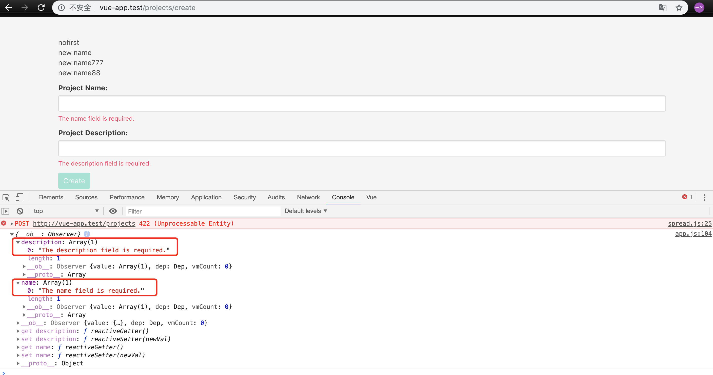

### 本节说明

* 对应第 21 小节：Object Oriented Forms Part-3

### 本节内容

上一节结束的时候，我们的 `Vue` 实例是下面这样：

```
.
.
new Vue({
    el:'#app',

    data: {
        form: new Form({
            name: '',
            description: '',
        })
    },

    methods: {
        onSubmit() {
            this.form.submit('post','/projects');
        }
    }
})
```

但是很多时候，我们在提交表单之后会做一些其他的动作，比如更新数据，并且很有可能每个实例拥有不同的动作，所以我们没办法进行抽象。我们期望能够像下面这样调用：

```
this.form.submit('post','/projects')
            .then()
            .catch();
```

[Promise](http://es6.ruanyifeng.com/#docs/promise) 是异步编程的一种解决方案，比传统的解决方案——回调函数和事件——更合理和更强大。它由社区最早提出和实现，ES6 将其写进了语言标准，统一了用法，原生提供了Promise对象。

所谓 Promise，简单说就是一个容器，里面保存着某个未来才会结束的事件（通常是一个异步操作）的结果。从语法上说，Promise 是一个对象，从它可以获取异步操作的消息。Promise 提供统一的 API，各种异步操作都可以用同样的方法进行处理。

我们将利用 [Promise](http://es6.ruanyifeng.com/#docs/promise) 来为 `Form` 类的 `submit()` 方法提供 `.then()` 和 `.catch()` 调用。

```
.
.
submit(requestType,url) {
    return new Promise((resolve,reject) => {
        axios[requestType](url,this.data())
            .then(response => {
                this.onSuccess(response.data)

                resolve(response.data);
            })
            .catch(error => {
                this.onFail(error.response.data.errors);

                reject(error.response.data.errors);
            });
    }); 
}

onSuccess(data) {
    alert(data.message);

    this.reset();
}

onFail(errors) {
    this.errors.record(errors);
}

reset() {
    for (let field in this.originalData) {
        this[field] = '';
    }

    this.errors.clear();
}
.
.
```

然后我们就可以这样调用：

```
.
.
new Vue({
    el:'#app',

    data: {
        form: new Form({
            name: '',
            description: '',
        })
    },

    methods: {
        onSubmit() {
            this.form.submit('post','/projects')
                .then(data => console.log(data))
                .catch(errors => console.log(errors));
        }
    }
})
```

我们在控制台分别打印出来成功和失败的返回：





最后我们再来做点重构：

```
.
.
data() {
    let data = {};

    for(let property in this.originalData) {
        data[property] = this[property];
    }

    return data;
}

post(url) {
    return this.submit('post',url);
}
.
.
onSubmit() {
    this.form.post('/projects')
        .then(data => console.log(data))
        .catch(errors => console.log(errors));
}
.
.
```

我们重写了 `data()` 方法，并且新增了 `post()` 方法。下一节我们继续前进！