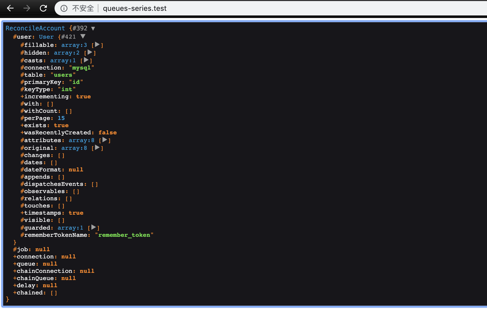

### 本节说明

* 对应第 10 小节：Source Diving the Dispatcher

### 本节内容

本节我们来开始探究队列任务的实现原理。首先我们恢复代码到第 8 节的样子：

*routes/web.php*

```
<?php

use App\Jobs\ReconcileAccount;
use App\User;

Route::get('/', function () {
    $user = User::first();

    ReconcileAccount::dispatch($user);

    return 'Done';
});
```

*app/Jobs/ReconcileAccount.php*

```
<?php

namespace App\Jobs;

use App\User;
use Illuminate\Filesystem\Filesystem;
use Illuminate\Bus\Queueable;
use Illuminate\Queue\SerializesModels;
use Illuminate\Queue\InteractsWithQueue;
use Illuminate\Contracts\Queue\ShouldQueue;
use Illuminate\Foundation\Bus\Dispatchable;

class ReconcileAccount implements ShouldQueue
{
    use Dispatchable, InteractsWithQueue, Queueable, SerializesModels;

    protected $user;

    /**
     * Create a new job instance.
     *
     * @return void
     */
    public function __construct(User $user)
    {
        $this->user = $user;
    }

    /**
     * Execute the job.
     *
     * @return void
     */
    public function handle()
    {
        logger('Record a user:' . $this->user->name);
    }

    public function tags()
    {
        return ['accounter'];;
    }
}
```

别忘了现在的队列驱动是 `database`,并且需要执行 `php artisan queue:work` 才会执行队任务。现在我们的队列任务的驱动是 `database`，并且是异步执行的。但是你知道为什么会异步执行吗？答案是 `Job` 类实现了 `ShouldQueue` 接口：

*app/Jobs/ReconcileAccount.php*

```
.
.
class ReconcileAccount implements ShouldQueue
{
    .
    .
}
```

然而，我们并非必须实现 `ShouldQueue` 接口。如果我们改成下面那样：

*app/Jobs/ReconcileAccount.php*

```
.
.
class ReconcileAccount
{
    .
    .
}
```

再次测试你会发现，我们的代码依然运行正常，但是与之前的不同之处在于，现在的队列任务是同步执行的，无论设置的队列驱动是什么。现在我们来探究下，why？首先，我们进到负责分发队列任务的 `Dispatchable` Contract：


```
<?php

namespace Illuminate\Foundation\Bus;

use Illuminate\Contracts\Bus\Dispatcher;

trait Dispatchable
{
    /**
     * Dispatch the job with the given arguments.
     *
     * @return \Illuminate\Foundation\Bus\PendingDispatch
     */
    public static function dispatch()
    {
        return new PendingDispatch(new static(...func_get_args()));
    }
    .
    .
}
```

我们调用的 `dispatch()` 方法会返回一个 `PendingDispatch` 类的实例。进入该类：

*vendor/laravel/framework/src/Illuminate/Foundation/Bus/PendingDispatch.php*

```
<?php

namespace Illuminate\Foundation\Bus;

use Illuminate\Contracts\Bus\Dispatcher;

class PendingDispatch
{
    .
    .
    /**
     * Handle the object's destruction.
     *
     * @return void
     */
    public function __destruct()
    {
        app(Dispatcher::class)->dispatch($this->job);
    }
}
```

在魔术方法 `__destruct()`中，`Laravel` 会给容器绑定实例，并且调用 `dispatch()` 方法执行任务。进入 `Dispatcher` 类：

*vendor/laravel/framework/src/Illuminate/Bus/Dispatcher.php*

```
<?php

namespace Illuminate\Bus;

use Closure;
use RuntimeException;
use Illuminate\Pipeline\Pipeline;
use Illuminate\Contracts\Queue\Queue;
use Illuminate\Contracts\Queue\ShouldQueue;
use Illuminate\Contracts\Container\Container;
use Illuminate\Contracts\Bus\QueueingDispatcher;

class Dispatcher implements QueueingDispatcher
{
    .
    .
    /**
     * Dispatch a command to its appropriate handler.
     *
     * @param  mixed  $command
     * @return mixed
     */
    public function dispatch($command)
    {
        if ($this->queueResolver && $this->commandShouldBeQueued($command)) {
            return $this->dispatchToQueue($command);
        }

        return $this->dispatchNow($command);
    }
    .
    .
    /**
     * Determine if the given command should be queued.
     *
     * @param  mixed  $command
     * @return bool
     */
    protected function commandShouldBeQueued($command)
    {
        return $command instanceof ShouldQueue;
    }
    .
    .
}
```

在 `dispatch()` 方法中，`Laravel` 就知道该以何种方式执行队列任务。如果同时满足 `$this->queueResolver` 和 `$this->commandShouldBeQueued($command)`，任务就会被放到队列中，否则，任务会被立即执行。`commandShouldBeQueued()` 方法的逻辑也很简单，仅仅是判断 `Job` 是否是 `ShouldQueue` 类，即是否实现了 `ShouldQueue` 接口。

我们没有实现 `ShouldQueue` 接口，所以我们会执行 `dispatchNow($command)` 方法：

```
/**
* Dispatch a command to its appropriate handler in the current process.
*
* @param  mixed  $command
* @param  mixed  $handler
* @return mixed
*/
public function dispatchNow($command, $handler = null)
{
    if ($handler || $handler = $this->getCommandHandler($command)) {
        $callback = function ($command) use ($handler) {
            return $handler->handle($command);
        };
    } else {
        $callback = function ($command) {
            return $this->container->call([$command, 'handle']);
        };
    }

    return $this->pipeline->send($command)->through($this->pipes)->then($callback);
}
```

我们没有 `$handler` 参数，所以我们会进入 `else` 的处理逻辑。你一定会好奇 `$command` 参数到底是什么，我们来 `dd()` 出来：

```
public function dispatchNow($command, $handler = null)
{
    if ($handler || $handler = $this->getCommandHandler($command)) {
        $callback = function ($command) use ($handler) {
            return $handler->handle($command);
        };
    } else {
        dd($command);
        $callback = function ($command) {
            return $this->container->call([$command, 'handle']);
        };
    }

    return $this->pipeline->send($command)->through($this->pipes)->then($callback);
}
```



所以把 `$command` 当成 `Job` 的实例化对象即可。在 `else` 逻辑中，`Laravel` 定义了 `$callback` 变量，它是一个闭包函数，它的作用是调用 `$command` 的 `handle()` 方法。接下来是真正的处理逻辑，也就是上一节我们探究的 `Pipline` 的一个具体实现而已。我们翻译一下：

```
$pipline->send(new ReconcileAccount)
    ->through([])
    ->then($callback);
```

是不是感觉很简单？还有一个地方值得注意，正如刚刚提到的那样， `$callback` 的作用是调用 `$command` 的 `handle()` 方法。那为什么我们不像下面这样使用呢？

```
$callback = function ($command) {
    return $command->handle();
};
```

在前面的章节我们曾经说过，`Job` 类的 `handle()` 方法中，我们可以任意注入需要的类，`Laravel` 会帮我们完成解析。如果我们直接使用 `$command->handle()` 的话，那也就意味着我们无法添加参数，更别说注入需要的类了。所以 `Laravel` 使用了：

```
return $this->container->call([$command, 'handle']);
```

动态绑定实例到容器，从而达到自动解析注入的目的。现在我们已经知道了队列任务同步执行的原理是绑定 `Dispatcher` 到容器，然后调用 `dispatch()` 方法，所以我们可以这样来实现：

*routes/web.php*

```
<?php

use App\Jobs\ReconcileAccount;
use App\User;
use Illuminate\Bus\Dispatcher;

Route::get('/', function () {
    return view('welcome');
});

Route::get('/', function () {
    $user = User::first();

    $job = new ReconcileAccount($user);

    resolve(Dispatcher::class)->dispatch($job);

    return 'Done';
});
```

顺便提一句，`Laravel` 提供了 `Bus` Facade，已经实现了 `resolve(Dispatcher::class)`。所以我们还可以简单写成下面这样：

```
<?php

use App\Jobs\ReconcileAccount;
use App\User;
use Illuminate\Support\Facades\Bus;

Route::get('/', function () {
    return view('welcome');
});

Route::get('/', function () {
    $user = User::first();

    $job = new ReconcileAccount($user);

    Bus::dispatch($job);

    return 'Done';
});

```

并且我们还知道，`Dispatcher` 类的 `dispatch()` 方法，其实就是 `Pipline` 的一个具体实现。所以我们甚至可以像下面这样实现：

```
<?php

use App\Jobs\ReconcileAccount;
use App\User;
use Illuminate\Pipeline\Pipeline;

Route::get('/', function () {
    return view('welcome');
});

Route::get('/', function () {
    $user = User::first();

    $job = new ReconcileAccount($user);

    $pipline = new Pipeline(app());

    $pipline->send($job)->through([])->then(function () use ($job) {
        $job->handle();
    });

    return 'Done';
});

```

OK，在这一节我们探究了队列任务同步执行的原理，下一节我们来探究队列任务是如何异步执行的，这也是大多数队列任务的执行方式。下节见罗~
