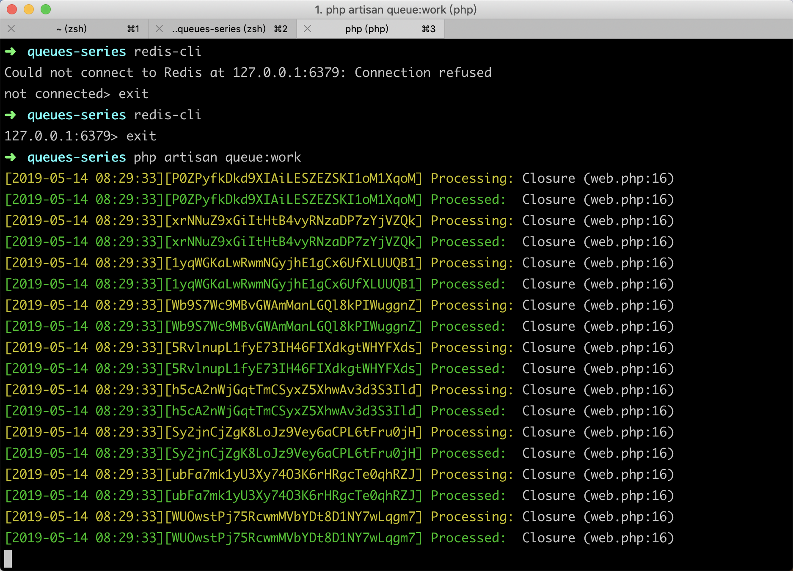

### 本节说明
* 对应第 2 小节：Dispatch Your First Job

### 本节内容

使用 `Laravel` 的便利之处就在于，你想要实现的功能 `Laravel` 几乎都为你实现了，例如我们要开发队列，我们只需要使用全局辅助函数 `dispatch()` 就可以了：

*routes/web.php*

```
Route::get('/', function () {
    
    dispatch(function () {
        logger('record something');
    });

    return 'Finished!';
});
```

>`logger()` 辅助函数会帮我们打印出日志

现在当你访问 [http://queues-series.test](http://queues-series.test) 时，你会发现日志时同步打出的。我们来看一下配置文件：

*config/queue.php*

```
.
'default' => env('QUEUE_CONNECTION', 'sync'),
.
```

而在配置文件 *.env* 中：

```
.
QUEUE_CONNECTION=sync
.
```

所以当前我们的队列驱动是同步机制，所以会实时打出日志。下面我们把驱动改为 `redis`：

```
.
QUEUE_CONNECTION=redis
.
```

然后再刷新几次页面，然后你会发现日志没有打印出来。这是因为打印日志的任务进入了队列，但是还没有执行。我们运行以下命令执行队列里的任务，并开启实时队列任务监听：

```
php artisan queue:work
```

你会看到以下界面：



然后日志也会被打印，而且更加方便地是，`dispatch()` 函数可以链式调用 `delay()` 方法，让你能够很方便地决定进入队列的任务触发的时机，比如 3 分钟后执行：

```
Route::get('/', function () {
    
    dispatch(function () {
        logger('record something');
    })->delay(now()->addMinutes(3));

    return 'Finished!';
});
```

>注：需要我们开启队列任务监听：`php artisan queue:work`

