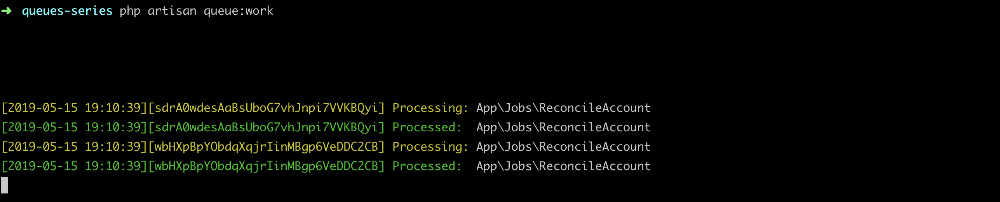

### 本节说明
* 对应第 3 小节：Job Classes and Daemons

### 本节内容

在大多数情况下，闭包函数只能处理简单的逻辑，当我们有复杂逻辑需要放到队列任务中时，通常的做法是建立一个 `Job`：

```
php artisan make:job ReconcileAccount
```

然后我们给 `dispatch()` 函数传参这个 `Job` 的实例即可：

*routes/web.php*

```
<?php

use App\Jobs\ReconcileAccount;

Route::get('/', function () {
    
    dispatch(new ReconcileAccount);

    return 'Finished!';
});

```

处理逻辑放在 `handle()` 方法中：

*app/Jobs/ReconcileAccount.php*

```
<?php

namespace App\Jobs;

use Illuminate\Bus\Queueable;
use Illuminate\Queue\SerializesModels;
use Illuminate\Queue\InteractsWithQueue;
use Illuminate\Contracts\Queue\ShouldQueue;
use Illuminate\Foundation\Bus\Dispatchable;

class ReconcileAccount implements ShouldQueue
{
    use Dispatchable, InteractsWithQueue, Queueable, SerializesModels;

    /**
     * Create a new job instance.
     *
     * @return void
     */
    public function __construct()
    {
        //
    }

    /**
     * Execute the job.
     *
     * @return void
     */
    public function handle()
    {
        logger('Record something new');
    }
}
```

如果我们开启队列任务监听，再刷新页面，你将会看到：



同时日志会被打印出来。注意 `SerializesModels` Contract，`Laravel` 利用它来进行模型实例的序列化与反序列化：我们在构造函数中注入实例后，当任务入队列时，`SerializesModels` Contract 会先序列化模型 ID 字段；当任务出队列执行时，`SerializesModels` Contract 会先根据序列化后的模型实例的 ID 反序列化出模型实例，让我们能够像平常一样进行调用。比如我们可以像下面这样注入一个 `User` 的实例:

*app/Jobs/ReconcileAccount.php*

```
<?php

namespace App\Jobs;

use App\User;
use Illuminate\Bus\Queueable;
use Illuminate\Queue\SerializesModels;
use Illuminate\Queue\InteractsWithQueue;
use Illuminate\Contracts\Queue\ShouldQueue;
use Illuminate\Foundation\Bus\Dispatchable;

class ReconcileAccount implements ShouldQueue
{
    use Dispatchable, InteractsWithQueue, Queueable, SerializesModels;

    protected $user;

    /**
     * Create a new job instance.
     *
     * @return void
     */
    public function __construct(User $user)
    {
        $this->user = $user;
    }

    /**
     * Execute the job.
     *
     * @return void
     */
    public function handle()
    {
        logger('Record someone:' . $this->user->name);
    }
}

```

*routes/web.php*

```
<?php

use App\Jobs\ReconcileAccount;
use App\User;

Route::get('/', function () {
    $user = User::first();
    
    dispatch(new ReconcileAccount($user));

    return 'Finished!';
});

```

我们刷新页面进行测试。如果你一直运行着 `php artisan queue:work` 的话，你会发现你的修改没有生效。这是因为运行 `php artisan queue:work` 之后，`Laravel` 会在后台以守护进程的形式运行队列任务，当我们对队列任务进行修改之后，你需要重新运行命令以使更改生效。再次测试就会发现在日志文件中，新的任务已经生效：

*storage/logs/laravel-2019-05-15.log*

```
[2019-05-15 22:04:11] local.DEBUG: Record someone:Joey Lebsack  
[2019-05-15 22:04:11] local.DEBUG: Record someone:Joey Lebsack
```

并且我们可以在 `handle()` 方法中注入任何我们想要注入的类，比如我们来存储一个文件，那你就可以像下面这样做：

*app/Jobs/ReconcileAccount.php*

```
<?php

namespace App\Jobs;

use App\User;
use Illuminate\Filesystem\Filesystem;
.
.

class ReconcileAccount implements ShouldQueue
{
    .
    .
    public function handle(Filesystem $file)
    {
        $file->put(public_path('test.txt'),'Recording ' . $this->user->name);

        logger('Record someone:' . $this->user->name);
    }
}

```

别忘了重新执行 `php artisan queue:work`，然后刷新页面，你就会看到生成的 `test.txt` 文件了。

*public/test.txt*

```
Recording Joey Lebsack
```

下一节我们继续前进。
