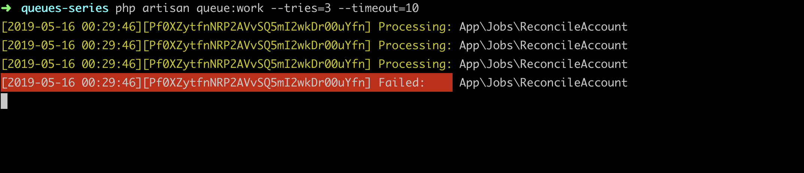
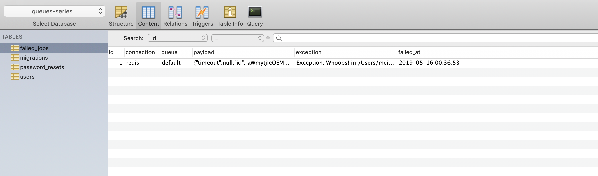

### 本节说明

* 对应第 5 小节：Failed Jobs

### 本节内容

 前面几节中我们的队列任务都是成功运行的，但是在实际中，很多时候会出现队列任务失败的情况。`Laravel` 提供了以下几个命令来处理失败的队列任务：

 * `php artisan queue:failed` 列出所有失败的队列任务
 * `php artisan queue:failed-table` 新建失败的队列任务的表数据库迁移文件，需要配合 `php artisan migrate` 命令使用
 * `php artisan queue:retry` 重试所有失败的队列任务

 现在我们来模拟队列任务失败的情形：

*app/Jobs/ReconcileAccount.php*

```
.
.
    public function handle(Filesystem $file)
    {
        throw new \Exception('Whoops!');
        
        logger('Record someone:' . $this->user->name);
    }
}
```

如果你开启了队列任务的监听，当你刷新页面的时候，你会发现队列任务会一直持续不断地重复执行、失败、重试、失败的流程，很快就会占满你电脑的内存。所以我们在开始队列任务监听的时候，要注意设置重试次数和等待时长：

```
php artisan queue:work --tries=3 --timeout=10
```

>如果你不清楚命令的用法，可以使用 `php artisan help ` 加命令来查看使用方法，例如：`php artisan help queue:work`

再次刷新页面：



接下来我们将失败的队列任务入库：

```
php artisan queue:failed-table
php artisan migrate
```

再次测试你就能在数据库中看到失败的队列任务了：



我们去掉测试代码，进行手动重试：

```
    .
    .
    public function handle(Filesystem $file)
    {
        // throw new \Exception('Whoops!');
        
        logger('Record someone:' . $this->user->name);
    }
}
```

可以指定失败的队列任务的 `id`：
```
php artisan queue:retry 1
```

同时你会发现数据库里的记录被删除掉了，因为该队列任务已经执行成功了。

下一节我们来研究 `Laravel` 提供的官方扩展包 [Laravel Horizon](https://laravel.com/docs/5.8/horizon) 来进行 Redis 队列任务的可视化管理。