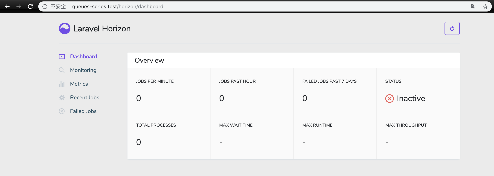

### 本节说明

* 对应第 6 小节：A Dashboard For Your Redis Backed Queues

### 本节内容

 [Laravel Horizon](https://laravel.com/docs/5.8/horizon) 是 Laravel 生态圈里的一员，为 Laravel Redis 队列提供了一个漂亮的仪表板，允许我们很方便地查看和管理 Redis 队列任务执行的情况。首先我们依照文档来进行安装：

 ```
composer require laravel/horizon
php artisan horizon:install
 ```

 安装完成后我们访问 [http://queues-series.test/horizon/dashboard](http://queues-series.test/horizon/dashboard) 可以看到以下界面：

 

 Horizon 是一个监控程序，需要常驻运行，我们可以通过以下命令启动：

```
php artisan horizon
```

启动后就可以在页面进行队列任务的监听了，更加详细的功能可以参看文档。