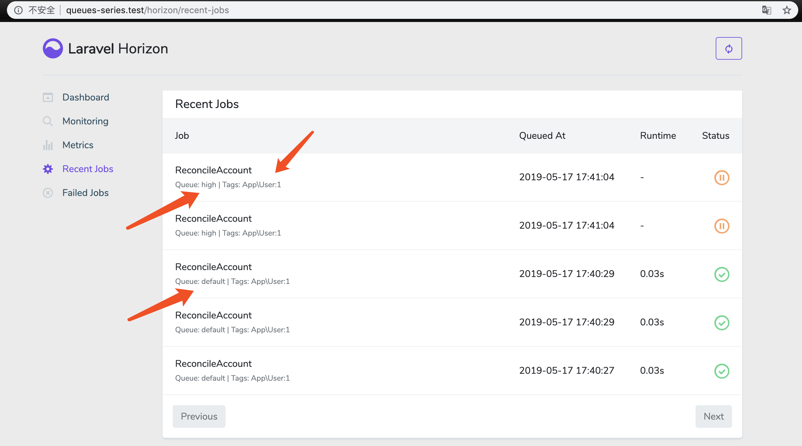
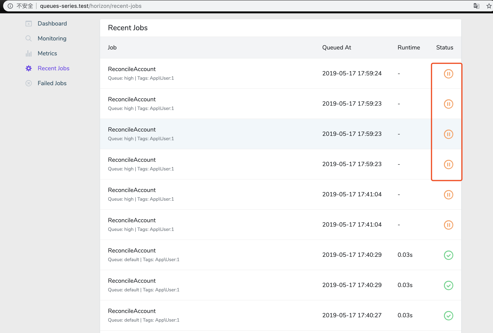
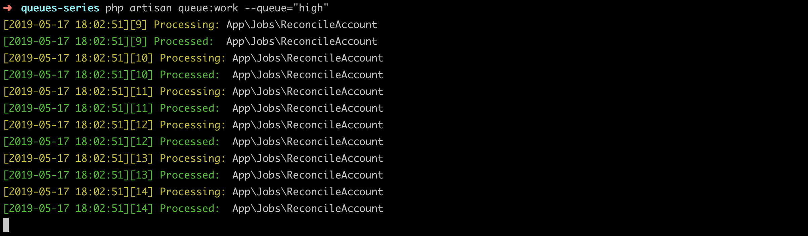
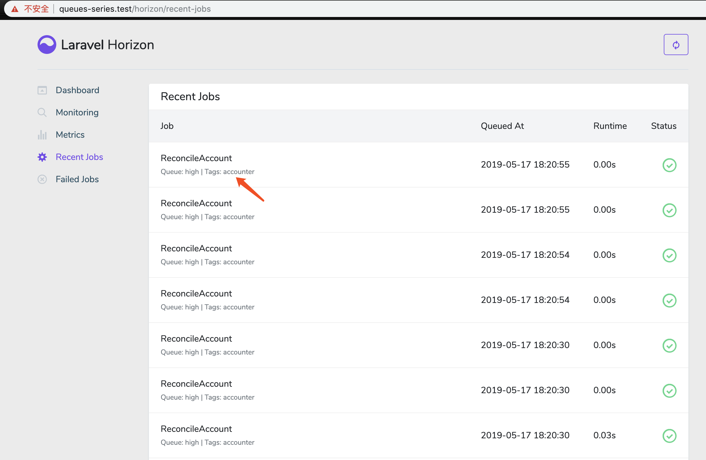
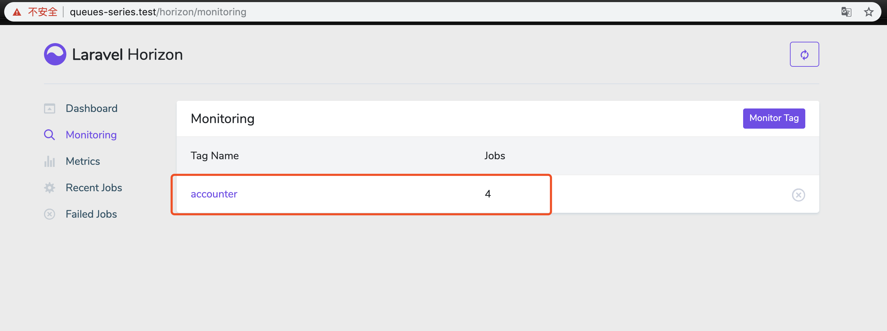

### 本节说明

* 对应第 7 小节：Multiple Queues and Workers

### 本节内容

 正如我们第一节所说，披萨店会有不同的工人处理不同的流程，我们的应用也会有不同的队列处理不同的逻辑。`Laravel` 生成的 `Job` 类默认引入了 `Queueable` Contract，该 Contract 提供了 `onQueue()` 方法来为队列任务指定队列名称：

 *vendor/laravel/framework/src/Illuminate/Bus/Queueable.php*

 ```
.
.
public function onQueue($queue)
{
    $this->queue = $queue;

    return $this;
}
.
.
 ```

 >注：队列名称是自定义的，不同特殊配置

 比如我们把任务放进 `high` 队列中：

 *routes/web.php*

 ```
<?php

use App\Jobs\ReconcileAccount;
use App\User;

Route::get('/', function () {
    $user = User::first();
    
    ReconcileAccount::dispatch($user)->onQueue('high');

    return 'Finished!';
});
 ```

 运行 Horizon：

 ```
php artisan horizon
 ```

 访问 Horizon 页面：

 

可以看到当前有两个队列，`default` 和 `high`，并且 `high` 队列的两个任务都处于暂停状态，这是因为 `Horizon` 默认只处理 `default` 队列中的任务。

`Laravel` 提供的队列监听命令可以让我们指定监听的队列名称：

```
php artisan queue:work --queue="default"
```

我们指定监听 `default` 队列，所以我们再次刷新页面，`high` 队列的任务也不会被执行。如下：



但是我们一旦指定监听 `high` 队列，那么所有的任务都会被执行：



并且，你可以指定不同队列的优先级，只有优先级高的队列任务全部被处理完才会继续处理优先级低的队列任务：

```
php artisan queue:work --queue="high,default"
```

当然，`Horizon` 为我们提供了相关配置，你只需像下面这样配置即可：

**

```
    .
    .
    'local' => [
            'supervisor-1' => [
                'connection' => 'redis',
                'queue' => ['high','default'],
                'balance' => 'simple',
                'processes' => 3,
                'tries' => 3,
            ],
        ],
    ],
];
```

最后补充一点，在 `Horizon` 的界面中，图中都会出现 `Tags` 标签，这是 `Horizon` 自动根据任务携带 `Eloquent` 模型给大多数任务标记得到的。我们可以利用 `Horizon` 的 `Monitoring` 功能对指定的 `Tag` 进行监听，同时我们也可以自定义队列任务的 `Tag`:

*app/Jobs/ReconcileAccount.php*

```
    .
    .
    public function tags()
    {
        return ['accounter'];;
    }
}
```

监听结果如下：






