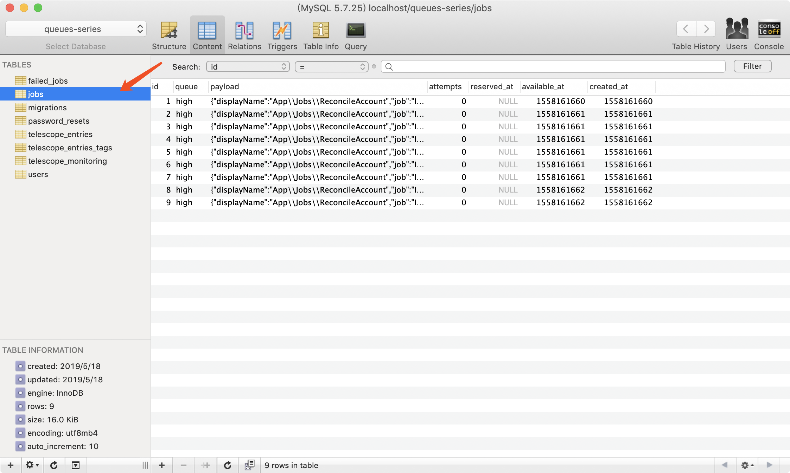

### 本节说明

* 对应第 8 小节：Storing Jobs in the Database

### 本节内容

到目前为止，我们的队列驱动是 `Redis`，但是我们仍然可以设置数据库作为队列任务的驱动。首先修改配置：

*.env*

```
.
QUEUE_CONNECTION=database
.
```

接着建立队列任务的表迁移文件并运行迁移：

```
php artisan queue:table
php artisan migrate
```



现在队列任务存储于数据库中，当任务执行之后，任务会从表中删除：

```
php artisan queue:work --queue="high"
```


