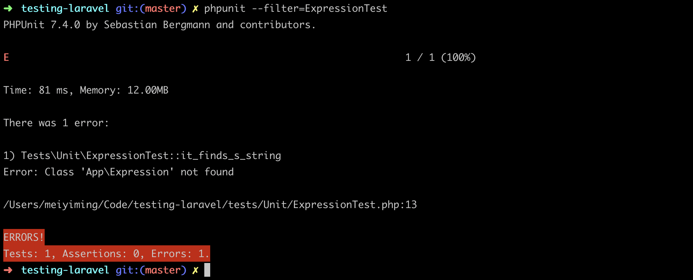
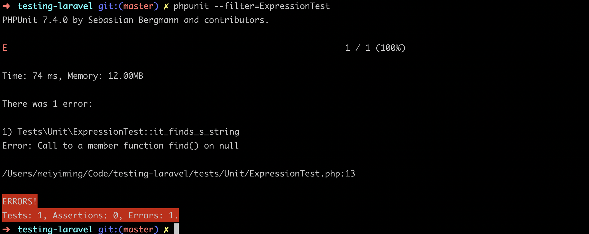
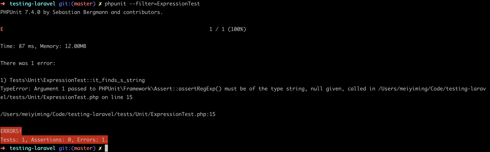
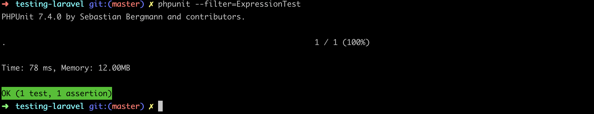
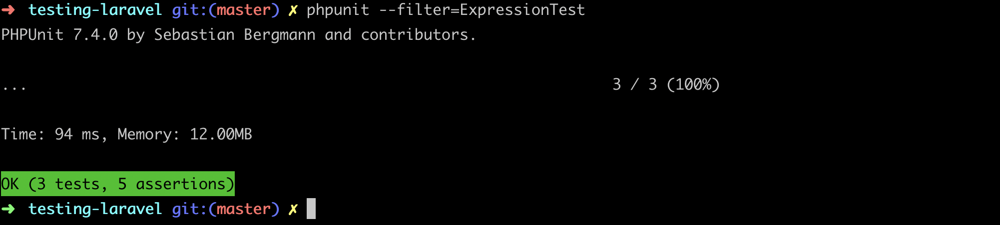
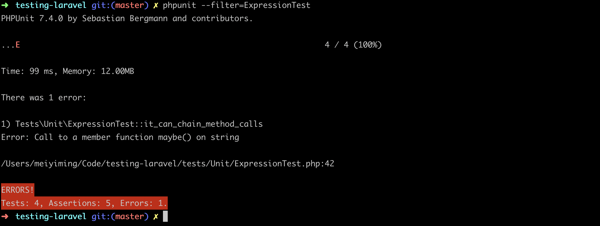
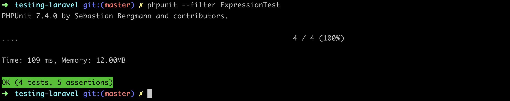
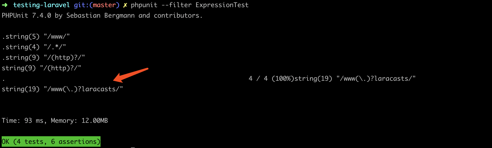

### 本节说明
* 对应第 11 小节：Design a Fluent API With TDD

### 本节内容
[VerbalExpressions](https://github.com/VerbalExpressions/JSVerbalExpressions) 是一个 JavaScript 库,用于构建困难的正则表达式，它也提供了其他语言如 C#，Java，PHP等的实现。本节我们来学习如何设计和开发这个库的 PHP 版本。

首先新建测试文件：

```
php artisan make:test ExpressionTest --unit
```

建立第一个单元测试：通过给定字符串构造正则表达式，例如，给定 `www` 构造 `/www/` 的正则表达式。如下：

*tests/Unit/ExpressionTest.php*

```
<?php

namespace Tests\Unit;

use Tests\TestCase;
use App\Expression;

class ExpressionTest extends TestCase
{
    /** @test */
    public function it_finds_s_string()
    {
        $regex = Expression::make()->find('www');

        $this->assertRegExp($regex,'www');
    }
}

```

运行测试当然会失败：



向前推进，新建 `ExpressionTest` 类文件：

*app/Expression.php*

```
<?php 

namespace App;

class Expression 
{
    public static function make()
    {
        
    }

    public function find()
    {
        
    }
}
```

再次测试：



 再来看下我们的代码：

```
 $regex = Expression::make()->find('www');
 ```

 在我们的设计中，make() 方法是某种意义上的构造函数，会返回一个对象。但是，此时此刻我们并不知道我们期望得到的对象的具体信息，所以我们暂且先返回类本身：

*app/Expression.php*

```
 <?php 

namespace App;

class Expression 
{
    public static function make()
    {
        return new Static;
    }

    public function find()
    {
        
    }
}
```

再次测试：



错误发生了改变，下面让我们做最小的改动以使我们的测试通过：

*app/Expression.php*

```
<?php 

namespace App;

class Expression 
{
    public static function make()
    {
        return new Static;
    }

    public function find($value)
    {
        return '/' . $value .'/';
    }
}
```

再次测试：




接下来我们新增 `then()` API，它实际上等同于 `find()`，但是更语义化。所以我们来为此增加测试逻辑：

```
/** @test */
public function it_finds_s_string()
{
    $regex = Expression::make()->find('www');

    $this->assertRegExp($regex,'www');

    $regex = Expression::make()->then('www');

    $this->assertRegExp($regex,'www');
}
```

增加 `then()` 方法：

```
.
.
public function find($value)
{
    return '/' . $value .'/';
}

public function then($value)
{
    return $this->find($value);
}
}
```

再次测试，成功通过。接下来为我们新增 `anything()` API，它匹配任意字符，所以正则表达式会是这样：`/.*/`。还是从测试开始：

```
    .
    .
    /** @test */
    public function it_checks_for_anything()
    {
        $regex = Expression::make()->anything();

        $this->assertRegExp($regex,'foo');
    }
}
```

添加 `anything()` API：

```
.
.
public function anything()
{
    return '/.*/';
}
```

运行测试：



接下来为我们新增 `maybe()` API，它选择性匹配给定字符串。例如给定 `http`，正则表达式会是这样：`/（http)?/`。还是从测试开始：

```
    .
    .
    /** @test */
    public function it_maybe_has_a_value()
    {
        $regex = Expression::make()->maybe('http');

        $this->assertRegExp($regex,'http');
        $this->assertRegExp($regex,'');
    }
}
```

添加 `maybe()` 方法：

```
    .
    .
    public function maybe($value)
    {
        return '/(' . $value . ')?/';
    }
}
```

再次测试即可成功通过。接下来我们来做点有意思的事情，为我们的方法加上链式调用，同时应用不同的规则构建正则表达式，比如：`Expression::make()->find('foo')->maybe('nar')->then('biz')`，则会构建 `// ` 的正则表达式。我们先写测试：

```
    .
    .
    /** @test */
    public function it_can_chain_method_calls()
    {
        $regex = Expression::make()->find('foo')->maybe('bar')->then('biz');

        $this->assertRegExp($regex,'foobarbiz');
    }
}
```

运行测试：



既然我们想要链式调用，那么我们的方法要返回的是实例化的类，所以我们要把正则表达式保存在该实例化的类属性中：

*app/Expression.php*

```
<?php 

namespace App;

class Expression 
{
    protected $expression;

    public static function make()
    {
        return new Static;
    }

    public function find($value)
    {
        $this->expression .=  '/' . $value .'/';

        return $this;
    }

    public function then($value)
    {
        return $this->find($value);
    }

    public function anything()
    {
        $this->expression .= '/.*/';

        return $this;
    }

    public function maybe($value)
    {
        $this->expression .=  '/(' . $value . ')?/';

        return $this;
    }
}
```

现在我们每个方法的调用都会返回实例化的类，但是你会发现，我们在每一个方法都组装成正则表达式的形式，当链式调用时就会出现格式错误；并且，在我们的测试中，我们直接以字符型类型访问类，这样程序会报错：

```
$regex = Expression::make()->then('www');
$this->assertRegExp($regex,'www');
```


我们利用 `PHP` 的魔术方法 `__toString()` 来为我们解决上面的两个问题：

```
<?php 

namespace App;

class Expression 
{
    protected $expression;

    public static function make()
    {
        return new Static;
    }

    public function find($value)
    {
        $this->expression .=  $value;

        return $this;
    }

    public function then($value)
    {
        return $this->find($value);
    }

    public function anything()
    {
        $this->expression .= '.*';

        return $this;
    }

    public function maybe($value)
    {
        $this->expression .=  '(' . $value . ')?';

        return $this;
    }

    public function __toString()
    {
        return '/' . $this->expression . '/';
    }
}
```

这样一来，我们只需做类型转换就能得到我们想要的正则表达式：

```
<?php

namespace Tests\Unit;

use Tests\TestCase;
use App\Expression;

class ExpressionTest extends TestCase
{
    /** @test */
    public function it_finds_s_string()
    {
        $regex = Expression::make()->find('www');

        $this->assertRegExp((string)$regex,'www');
    }

    /** @test */
    public function it_checks_for_anything()
    {
        $regex = Expression::make()->anything();

        $this->assertRegExp((string)$regex,'foo');
    }

    /** @test */
    public function it_maybe_has_a_value()
    {
        $regex = Expression::make()->maybe('http');

        $this->assertRegExp((string)$regex,'http');
        $this->assertRegExp((string)$regex,'');
    }

    /** @test */
    public function it_can_chain_method_calls()
    {
        $regex = Expression::make()->find('foo')->maybe('bar')->then('biz');

        $this->assertRegExp((string)$regex,'foobarbiz');
    }
}
```

>注意 `(string)$regex` 的使用

现在再次运行测试：



但是你一定不愿意每次测试时都要进行类型转换，所以我们来增加一个方法，专门为我们进行正则表达式的匹配校验：

*app/Expression.php*

```
    .
    .
    public function test($value)
    {
        return (bool)preg_match($this->__toString(),$value);
    }

    public function __toString()
    {
        return '/' . $this->expression . '/';
    }
}
```

> `preg_match()` 返回的是 0 或 1，所以要进行类型转换

接下来修改测试：

```
<?php

namespace Tests\Unit;

use Tests\TestCase;
use App\Expression;

class ExpressionTest extends TestCase
{
    /** @test */
    public function it_finds_s_string()
    {
        $regex = Expression::make()->find('www');

        $this->assertTrue($regex->test('www'));
    }

    /** @test */
    public function it_checks_for_anything()
    {
        $regex = Expression::make()->anything();

        $this->assertTrue($regex->test('foo'));
    }

    /** @test */
    public function it_maybe_has_a_value()
    {
        $regex = Expression::make()->maybe('http');

        $this->assertTrue($regex->test('http'));
        $this->assertTrue($regex->test(''));
    }

    /** @test */
    public function it_can_chain_method_calls()
    {
        $regex = Expression::make()->find('foo')->maybe('bar')->then('biz');

        $this->assertTrue($regex->test('foobarbiz'));
    }
}

```

运行测试，测试通过。接下来我们来修复一个隐藏的很深的 bug，首先我们来修改下最后一个测试：

```
    .
    .
    /** @test */
    public function it_can_chain_method_calls()
    {
        $regex = Expression::make()->find('www')->maybe('.')->then('laracasts');

        $this->assertTrue($regex->test('www.laracasts'));
        $this->assertFalse($regex->test('wwwXlaracasts'));
    }
}
```

但是运行测试会失败，因为在正则表达式中 `.` 字符具有特殊的意义，它会匹配任意一个字符。所以我们如果想要匹配 `.` 字符本身时，我们需要进行转义：`\.`。我们来利用 PHP 提供的 `preg_quote()` 方法转义正则表达式字符：

```
.
.
public function find($value)
{
    $value = preg_quote($value,'/');

    $this->expression .=  $value;

    return $this;
}
.
.
public function maybe($value)
{
    $value = preg_quote($value,'/');

    $this->expression .=  '(' . $value . ')?';

    return $this;
}
.
.
```

再次运行测试即可成功通过。我们来打印出每一个测试时生成的正则表达式：

```
.
.
public function getRegex()
{
    return '/' . $this->expression . '/';
}

public function test($value)
{
    var_dump($this->getRegex());

    return (bool)preg_match($this->getRegex(),$value);
}
```

>我们新增了 `getRegex()` 方法来获取生成的正则表达式



一个月之后我可能不知道 `$value = preg_quote($value,'/')` 的目的是什么，所以我们来把它抽取到函数中，取一个可读性高的名字：

```
public function find($value)
{
    $value = $this->sanitize($value);

    $this->expression .=  $value;

    return $this;
}
.
.

public function maybe($value)
{
    $value = $this->sanitize($value);

    $this->expression .=  '(' . $value . ')?';

    return $this;
}

protected function sanitize($value)
{
    return preg_quote($value,'/');
}
```

当然，重构之后需要运行测试，并且要让测试全部通过。然后，我们发现很多地方重复了以下代码：

```
$value = $this->sanitize($value);

$this->expression .=  '(' . $value . ')?';

return $this;
```

我们来进行重构：

```
<?php 

namespace App;

class Expression 
{
    protected $expression;

    public static function make()
    {
        return new Static;
    }

    public function find($value)
    {
        return $this->add($this->sanitize($value));
    }

    public function then($value)
    {
        return $this->find($value);
    }

    public function anything()
    {
        return $this->add('.*');
    }

    public function maybe($value)
    {
        $value = $this->sanitize($value);

        return $this->add("($value)?");
    }

    protected function sanitize($value)
    {
        return preg_quote($value,'/');
    }

    protected function add($value)
    {
        $this->expression .= $value;
        
        return $this;
    }

    public function getRegex()
    {
        return '/' . $this->expression . '/';
    }

    public function test($value)
    {
        return (bool)preg_match($this->getRegex(),$value);
    }

    public function __toString()
    {
        return $this->getRegex();
    }
}
```

我们将构造表达式的逻辑放在 `add()` 方法中统一处理，当然，测试仍旧是通过的。接下来为我们新增 `anythingBut()` API，它会排除指定的字符串。依然是从测试开始：

```
.
.
/** @test */
    public function it_can_exclude_values()
    {
        $regex = Expression::make()
                    ->find('foo')
                    ->anythingBut('bar')
                    ->then('biz');

        $this->assertTrue($regex->test('foobazbiz'));
        $this->assertFalse($regex->test('foobarbiz'));
    }   
}
```

这个时候运行测试会失败，我们来添加 `anything()` 方法：

```
.
.
public function anything()
{
    return $this->add('.*');
}

public function anythingBut($value)
{
    $value = $this->sanitize($value);

    return $this->add("(?!$value).*?");
}
.
.
```

运行测试，测试通过。现在我们已经有了一个基础，在这个基础上你可以开发任意你想要添加的 `API`，不试一试吗？